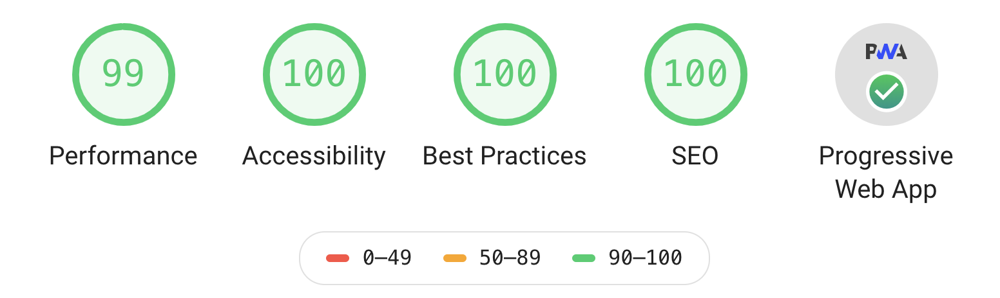

# igorstar.com

<p>
  <a href="https://github.com/prettier/prettier">
    
  </a>
</p>

<p>
  <strong>
    You can access this blog online at <a href="https://igorstar.com">www.igorstar.com</a>.
  </strong>
</p>

<p>
  <a href="https://github.com/fabe/gatsby-universal">
    
  </a>
</p>

<p>
  Based on an <em>opinionated</em> Gatsby v2 starter with React Context, styled-components, page transitions, scroll events with <code>IntersectionObserver</code> and a focus on accessibility and SEO. Made for state-of-the-art marketing sites.
</p>

***

## Features

- [X] 🤩 Page Transitions, component-based (with no-js support)
- [X] 👮‍♂️ `IntersectionObserver`, component-based (with polyfill)
- [X] 🌿 React Context for global UI state, with SSR
- [X] 💅 [`styled-components`](https://www.styled-components.com/) v4
- [X] 💯 Optimized with [Google Lighthouse](https://developers.google.com/web/tools/lighthouse/) (including test)
- [X] 🔥 Code Splitting of CSS and JS (component based)
- [X] 🔪 Inline SVG support
- [X] ⚙️ One config file for site-wide settings
- [X] 💙 Most social + meta tags in one component
- [X] 🖼 All favicons generated, only one icon file needed
- [X] 🌐 Offline support
- [X] 📄 Manifest support
- [X] 🗺 Sitemap support
- [X] 📱 Generated media queries for easy use
- [X] 😎 [Prettier](https://prettier.io/) for code style
- [X] 👨‍🏫 ESLint (based on [`eslint-plugin-react`](./.eslintrc))
- [X] 🌅 Responsive gallery with [`react-photo-gallery`](https://www.npmjs.com/package/react-photo-gallery)
- [X] 🎞 Loading images from s3 using [`gatsby-source-s3-image`](https://www.gatsbyjs.org/packages/gatsby-source-s3-image/)

Do you have suggestions or feedback? [Open an issue](https://github.com/igor-starostenko/igorstar/issues)!

## Lighthouse scores



## Usage

```bash
# Clone repo
git clone https://github.com/igor-starostenko/igorstar.git
cd igorstar
yarn install

# To develop
yarn develop

# To build
yarn build

# To test SSR (for Lighthouse etc.)
yarn ssr

# To format JS (precommit)
yarn format

# To generate favicons (included in `build`)
yarn build:favicons
```

## Author

* Igor Starostenko ([@IgorStarostenko](https://twitter.com/IgorStarostenko))
