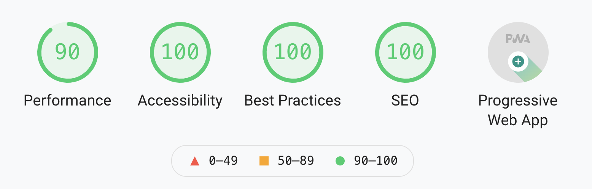

# igorstar.com

<p>
  <a href="https://github.com/prettier/prettier">
    
  </a>
</p>

<p>
  <strong>
    You can access it online at <a href="https://igorstar.com">www.igorstar.com</a>.
  </strong>
</p>

<p>
  Personal blog and portfolio. Feel free to use it as a template.
</p>

<p>
  <a href="https://github.com/igor-starostenko/igorstar/blob/master/license.md">
    
  </a>
</p>

***

## Features

- [X] 🌿 Static site based on [NextJS](https://nextjs.org/)
- [X] 🎞 [Contentful CMS](https://contentful.github.io/) integrated
- [X] ⚙️ [AWS Amplify](https://aws.amazon.com/amplify/) deployment ready (static export)
- [X] 🤩 Page Transitions with [`framer-motion`](https://www.framer.com/motion/)
- [X] 💅 [`styled-components`](https://www.styled-components.com/)
- [X] 💯 Optimized with [Google Lighthouse](https://developers.google.com/web/tools/lighthouse/) (including test)
- [X] 🔥 Code Splitting of CSS and JS (component based)
- [X] 🔪 Inline SVG support
- [X] ⚙️ One config file for site-wide settings
- [X] 💙 Most social + meta tags in one component
- [X] 🖼 All favicons generated, only one icon file needed
- [X] 🌐 Offline support
- [X] 📄 Manifest support
- [X] 🗺 Sitemap autogenerated
- [X] 😎 [Prettier](https://prettier.io/) for code style
- [X] 👨‍🏫 ESLint (based on [`next/core-web-vitals`](./.eslintrc))
- [X] 🌅 Responsive gallery with [`react-photo-gallery`](https://www.npmjs.com/package/react-photo-gallery)
- [X] 🤖 Agent skills for usage, best practices and AWS Amplify workflows

Do you have suggestions or feedback? [Open an issue](https://github.com/igor-starostenko/igorstar/issues)!

## Lighthouse scores



## Usage

```bash
# Clone repo
git clone https://github.com/igor-starostenko/igorstar.git
cd igorstar
yarn install

# To develop
yarn dev

# To build (output to out/ directory)
yarn build

# To preview production build locally
yarn start

# To test
yarn test

# To verify code style
yarn lint

# To format JS (precommit)
yarn format

# To generate favicons (included in `build`)
yarn build:favicons

# To generate sitemap (included in `build`)
yarn build:sitemap

# To backup contentful content by content type
yarn contentful:backup

# To export all data from contentful
yarn contentful:export
```

## Author

* Igor Starostenko (<contact@igorstar.com>)

[License](./license.md)
